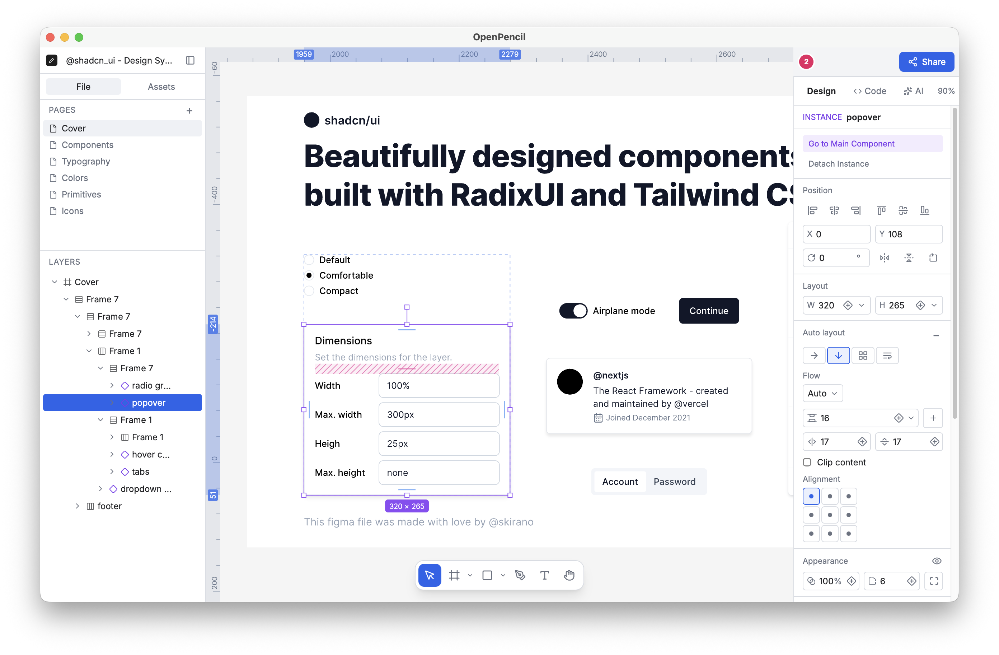

# OP Embedded Studio

嵌入式 UI 设计、交互原型、固件烧录与无线传输平台。它将可视化设计画布与真实 ESP32 显示设备连接起来，让设计内容可以直接预览、烘焙、传输和烧录。

An embedded UI design, interaction prototyping, firmware flashing, and wireless content transfer platform. OP Embedded Studio connects a visual design canvas to real ESP32 display hardware so that interfaces can be previewed, baked, transferred, and flashed directly to a device.

> **项目来源与致谢：** 本项目最初基于 [OpenPencil](https://github.com/open-pencil/open-pencil) 开发。感谢 OpenPencil 原作者与社区提供优秀的开源设计编辑器基础，包括画布、文档格式、渲染、排版、AI、MCP 和 CLI 等能力。由于嵌入式设备、固件和传输链路相关改动较大，OP Embedded Studio 目前作为独立衍生项目维护，与 OpenPencil 官方项目不存在隶属关系。
>
> **Origin and acknowledgements:** This project was originally built on top of [OpenPencil](https://github.com/open-pencil/open-pencil). We sincerely thank the OpenPencil authors and community for the open-source editor foundation, including its canvas, document model, rendering, typography, AI, MCP, and CLI capabilities. Because OP Embedded Studio has diverged substantially around embedded hardware, firmware, and transfer workflows, it is now maintained as an independent derivative project and is not affiliated with or endorsed by the official OpenPencil project.

## 当前重点适配设备

目前完整适配 [Waveshare ESP32-S3-Touch-AMOLED-1.75C](https://docs.waveshare.net/ESP32-S3-Touch-AMOLED-1.75C)：

- 466 × 466 圆形 AMOLED 屏幕
- ESP32-S3 平台
- CO5300 显示控制器
- QSPI 显示接口
- 圆形可视区域与居中裁切
- RGB565 色彩转换与映射
- TE 同步与整帧刷新链路
- Boot 键与触屏交互输入

其他屏幕 profile 仍保留在设备目录中，便于后续扩展；当前默认设备为上述 Waveshare 屏幕。

## 核心能力

- 在设计画布中制作面向嵌入式屏幕的 Frame
- 将静态 Frame 烘焙为设备可直接显示的 RGB565 内容
- 创建可命名、可连续切换的多 Frame 交互状态机
- 支持单图与 PNG 序列帧内容
- 首次通过 USB 初始化预编译基础固件，后续仅高速更新内容
- 通过 Wi-Fi 或 BLE 无线更新设备内容
- 将固定 Frame 通过 Wi-Fi 实时镜像到设备
- 使用独立 Android BLE App 拍照、选图、裁切并上传
- 保留 OpenPencil 的设计编辑、AI、MCP、CLI 和设计转代码基础能力
- 使用面向嵌入式小屏的 AI 设计助手，可粘贴参考图并回看实际画布渲染结果



## What OP Embedded Studio Does

- **Design for real embedded displays** — create screen-sized Frames with the existing visual editor and target a concrete device profile.
- **Bake and upload a Frame** — render the selected Frame, apply placement and circular clipping rules, convert it to the device color format, and upload only the content through USB.
- **Build interaction prototypes** — connect multiple Frames with tap, double-tap, triple-tap, long-press, Boot-button, and other supported transitions.
- **Play PNG sequences** — package ordered image sequences for device-side playback without changing the normal single-image workflow.
- **Transfer over Wi-Fi** — initialize the device with dedicated Wi-Fi firmware and upload Frame or state-machine content wirelessly.
- **Transfer over BLE** — initialize the BLE firmware, connect from a supported browser or the Android uploader, and send content without a serial cable.
- **Mirror a Frame in real time** — watch a fixed Frame for changes and deliver ordered updates to the display over the dedicated Wi-Fi realtime channel.
- **Keep device modes isolated** — USB, Wi-Fi, BLE, and realtime firmware resources are maintained as separate modes to reduce cross-mode regressions.
- **Design with visual AI context** — paste reference images into the embedded-first AI composer and let vision-capable models inspect the rendered canvas before finalizing a screen.

## 传输模式

| 模式           | 单 Frame | 状态机 | PNG 序列 | 说明                                                         |
| -------------- | -------: | -----: | -------: | ------------------------------------------------------------ |
| USB            |       ✅ |     ✅ |       ✅ | 首次初始化预编译基础固件，后续仅上传 Frame、状态机或序列内容 |
| Wi-Fi          |       ✅ |     ✅ |       ✅ | 首次通过 USB 初始化专用固件，后续无线传输内容                |
| BLE            |       ✅ |     ✅ |       ✅ | 支持浏览器 Web Bluetooth 与 Android BLE App                  |
| Wi-Fi 实时镜像 |       ✅ |      — | 自动更新 | 固定一个 Frame，设计变化后按顺序同步到设备                   |

不同模式拥有独立的状态、固件入口和传输适配器。切换模式不会复用其他模式的临时内容或连接状态。

## 基本工作流

### USB

1. 选择设备与串口。
2. 首次使用时，在“首次使用 / 设备维护”中初始化预编译 USB 基础固件。
3. 选择单 Frame 或状态机模式。
4. 选择画布中的目标 Frame，或选择本地图片/PNG 序列并上传；后续不会重复烧录应用固件。

### Wi-Fi / BLE

1. 在“首次使用与设备维护”中，通过 USB 烧录对应的预编译基础固件。
2. 连接设备创建的 Wi-Fi，或在浏览器/Android App 中连接 BLE 设备。
3. 选择单 Frame、状态机或 PNG 序列内容。
4. 无线上传，设备端显示传输与刷新状态。

### Wi-Fi 实时镜像

1. 烧录独立的 Realtime 固件。
2. 连接设备网络并选择一个固定 Frame。
3. 开始镜像；后续对该 Frame 的修改会按顺序烘焙并传输。

## 本地运行

当前项目主要以源码方式开发和运行。

```sh
bun install
bun run dev
```

默认开发地址：

```text
http://localhost:1420
```

大部分常用设备 profile 与无线基础固件已作为静态资源随项目提供。只有新增屏幕、修改底层驱动或重新生成基础固件时，才需要使用嵌入式构建服务：

```sh
bun run embedded:server
```

## Android BLE App

项目包含一个独立、轻量的 Android BLE 图片上传器：

- 拍照或选择本地图片
- 圆形画布预览
- 双指缩放和拖动裁切
- 自动连接目标 BLE 设备并上传
- 无需运行完整的桌面编辑器

构建命令：

```sh
bun run mobile:apk
```

Android 工程位于 `tools/android-ble-uploader/`。

## 版本与发布

OP Embedded Studio 桌面端与 Android BLE 上传器独立维护版本：

| 产品 | 标签格式 | 版本文件 |
| --- | --- | --- |
| OP Embedded Studio 桌面端 | `studio-vX.Y.Z` | `package.json`、`desktop/tauri.conf.json`、`desktop/Cargo.toml` |
| Android BLE 上传器 | `android-vX.Y.Z` | `tools/android-ble-uploader/app/build.gradle` |

历史标签 `v0.3.5` 保留为 Android 上传器的旧版标签，后续不再使用无前缀的 `v*` 标签。桌面端自动更新已暂停，待项目建立自有签名密钥和更新清单后再恢复。

The desktop Studio and Android uploader use independent versions. Desktop releases use `studio-vX.Y.Z`; Android releases use `android-vX.Y.Z`. The inherited desktop updater is disabled until OP Embedded Studio has its own signing key and update manifest.

## 嵌入式模块结构

嵌入式能力尽量与上游编辑器保持解耦：

```text
src/features/embedded-display/        前端设备面板、状态与传输适配器
  adapters/                            图片、USB、Wi-Fi、BLE 等适配层
  components/                          设备与交互界面
  composables/                         前端状态和业务编排
  live-mirror/                         Wi-Fi 实时镜像
  model/                               类型与领域模型
  runtime/                             设备目录与静态固件入口

tools/embedded-display/                固件工程、构建服务与屏幕 profile
tools/android-ble-uploader/            独立 Android BLE 上传器
tools/embedded-display/prebuilt-firmware/  可直接调用的预编译固件资源
```

设备 profile、内容转换、传输协议和界面状态分别维护，方便未来同步 OpenPencil 上游更新，或新增屏幕、控制器和传输方式。

## OpenPencil 基础能力

OP Embedded Studio 仍保留并使用大量 OpenPencil 能力，包括：

- `.fig` 与 `.pen` 文档读写
- CanvasKit / Skia 渲染
- Yoga 自动布局
- 组件、变量和图层编辑
- AI 设计助手
- MCP 与 CLI
- HTML、CSS、JSX 和 Tailwind 相关工作流

这些能力属于项目的编辑器基础，但本仓库的主要产品方向是嵌入式 UI 原型、设备预览与内容传输。OpenPencil 的原始用法和完整文档请访问其[官方仓库](https://github.com/open-pencil/open-pencil)。

## 开发检查

```sh
bun run check:vue
bun run build
bun test tests/engine/app/embedded-display-runtime.test.ts
```

仓库不包含 OpenPencil 上游的大型 Git LFS 测试素材。相关说明见 `tests/fixtures/README.md`；这些测试素材不参与产品运行，也不影响中文字体 fallback。中文 fallback 优先使用系统字体，并可通过在线字体提供方加载和缓存 Noto Sans SC 等字体。

## Acknowledgements

- [OpenPencil](https://github.com/open-pencil/open-pencil) — the open-source editor foundation on which this project was originally built.
- The OpenPencil authors and contributors — for the canvas, renderer, document model, typography, AI, MCP, CLI, and the broader development work inherited by this repository.
- [Waveshare](https://www.waveshare.com/) — for the ESP32-S3-Touch-AMOLED-1.75C hardware and technical documentation used by the current primary device integration.
- [@sld0Ant](https://github.com/sld0Ant) — for creating and maintaining the original OpenPencil documentation site.

## License

This project is distributed under the MIT License. See `LICENSE` for details.

The original OpenPencil copyright and license notices are retained in accordance with the MIT License.
