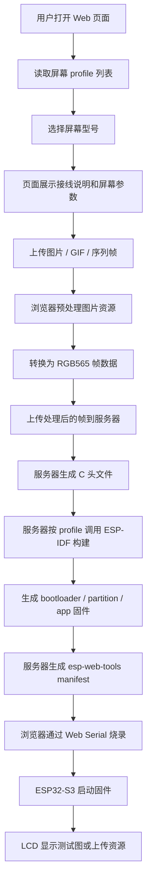
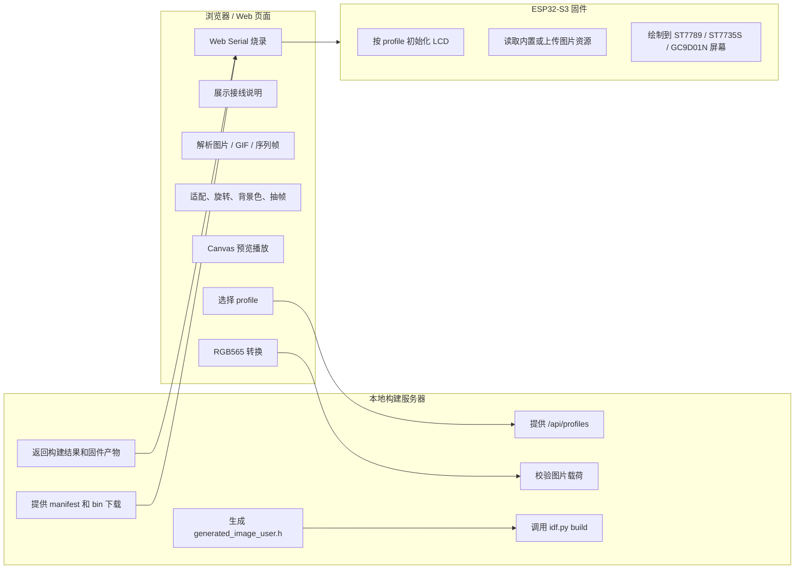
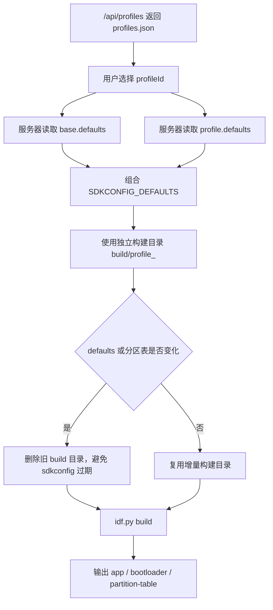
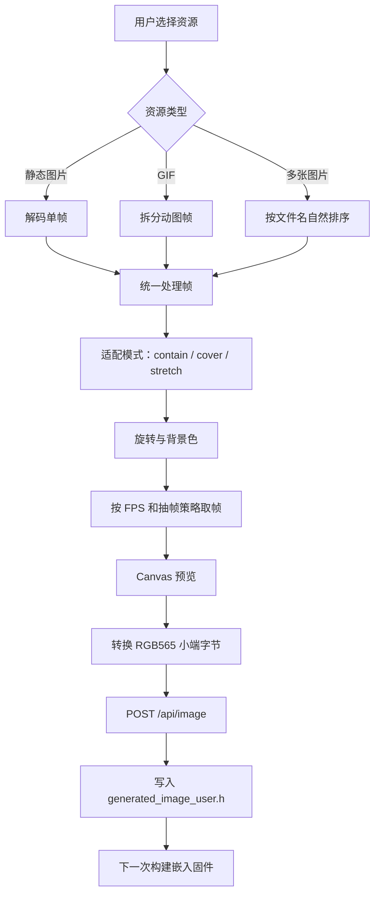
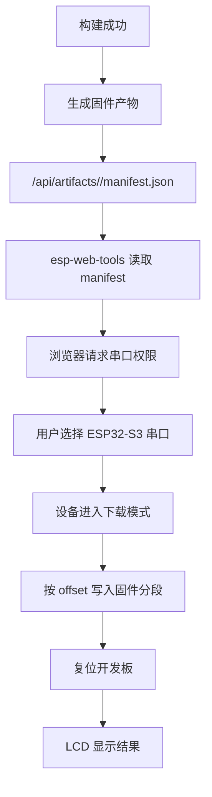
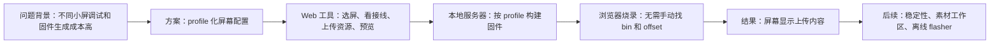

# LCD 图片固件生成与浏览器烧录工具：汇报流程图与操作指引

本文档用于项目汇报和现场演示。它聚焦两件事：

- 用流程图说明项目工作逻辑。
- 给出一套可照着执行的演示操作指引。

## 一句话介绍

这是一个面向 ESP32-S3 + SPI LCD 小屏的 Web 工具。用户在浏览器里选择屏幕型号、上传图片或动图，服务器按对应 profile 构建固件，最后通过浏览器串口把固件烧录到开发板，屏幕显示上传内容。

当前支持：

| Profile ID | 屏幕 | 分辨率 | 状态 |
| --- | --- | --- | --- |
| `st7789_qs130tab1005a` | QS130TAB1005A ST7789 方屏 | 240x240 | 已验证 |
| `st7735s_lb090r_if03` | LB090R-IF03 ST7735S 圆屏 | 128x128 | 已验证 |
| `gc9d01n_gvh099wq010b_a0` | GVH099WQ010B-A0 GC9D01N 0.99 英寸圆屏 | 160x160 | 待实物最终验证 |

## 总体工作逻辑



## 浏览器和服务器分工



汇报时可以强调：浏览器负责交互和图片处理，服务器负责 profile、构建和产物，固件负责屏幕初始化和显示。这个边界让服务器保持轻量，也避免服务器处理原始图片编解码。

## Profile 构建逻辑



当前构建命令等价于：

```bash
idf.py -B build/profile_<profileId> \
  -DSDKCONFIG=build/profile_<profileId>/sdkconfig \
  -DSDKCONFIG_DEFAULTS="screen_profiles/base.defaults;<profile defaults>" \
  build
```

## 图片资源处理逻辑



关键点：

- 服务器接收的是处理后的 RGB565 帧，不是原始图片文件。
- 上传尺寸必须匹配所选 profile 的逻辑分辨率。
- 当前最大帧数为 120，RGB565 原始数据上限为 4 MiB。
- 未上传图片时，固件显示默认几何测试图。

## 浏览器烧录逻辑



固件烧录分段：

```text
0x0000   bootloader.bin
0x8000   partition-table.bin
0x10000  st7789_simple.bin
```

当前 Web 烧录默认使用 CDN 版本 `esp-web-tools`。这是经过 A/B 验证后的稳定性选择：本地 vendor 版本可以显示按钮，但真实设备初始化阶段不够稳定；CDN 版本已验证可以完成烧录。

## 现场演示前准备

硬件：

- ESP32-S3 开发板，已验证配置为 8 MiB Flash / 8 MiB PSRAM。
- 已接好的 ST7789 240x240 方屏或 ST7735S 128x128 圆屏。
- 稳定 USB 数据线。
- 可以进入下载模式的 BOOT / RESET 按键。

软件：

- Chrome 或 Edge，且支持 Web Serial。
- ESP-IDF 环境可用。
- 本地服务器能访问 `http://127.0.0.1:8765`。
- 演示图片提前准备好，建议准备一张静态图和一个短 GIF。

建议演示前先完整跑一遍：

1. 启动服务器。
2. 打开 Web 页面。
3. 选择 profile。
4. 上传图片并预览。
5. 构建。
6. 浏览器烧录。
7. 看屏幕显示。

## 启动服务器

在终端执行：

```bash
cd /Users/fengqihao/esp-idf
. ./export.sh
python3 examples/peripherals/lcd/st7789_simple/server/build_server.py
```

看到下面输出表示启动成功：

```text
LCD profile build server listening on http://127.0.0.1:8765
Project directory: /Users/fengqihao/esp-idf/examples/peripherals/lcd/st7789_simple
```

这个终端保持打开。

## 打开 Web 页面

用 Chrome 或 Edge 打开：

```text
http://127.0.0.1:8765
```

页面打开后先确认：

- 左侧或顶部能看到屏幕 profile。
- 当前 profile 信息能显示分辨率、驱动 IC、接线说明。
- 构建按钮在选择 profile 后可用。

## 演示操作流程

### 1. 选择屏幕 Profile

根据现场接线选择：

- ST7789 方屏：`QS130TAB1005A 240x240 ST7789 方屏`
- ST7735S 圆屏：`LB090R-IF03 128x128 ST7735S 圆屏`

讲解点：

- 不同屏幕不是写死在代码里，而是通过 profile 管理。
- profile 同时包含显示参数、构建 defaults、接线说明和可视区域信息。
- 每个 profile 使用独立 build 目录，避免配置互相污染。

### 2. 展示接线说明

展开或查看接线说明。

讲解点：

- 页面直接从 `profiles.json` 读取接线数据。
- 对调试人员来说，选屏幕后可以直接看到 FPC 引脚到 ESP32-S3 GPIO 的对应关系。
- 当前 LCD 使用写 SPI，不接 MISO。

### 3. 上传图片资源

可以选择：

- 单张 PNG / JPG / BMP / WebP。
- 一个 GIF。
- 多张按编号命名的图片作为序列帧。

上传后调整：

- 适配模式。
- 旋转角度。
- 背景色。
- FPS。
- 抽帧模式。

讲解点：

- 浏览器会先预览处理结果。
- 用户看到的预览就是即将嵌入固件的帧效果。
- 圆屏虽然逻辑分辨率是 128x128，但实际可视区域是圆形，角落内容可能被裁掉，这是正常现象。

### 4. 检查预览和资源信息

使用播放、暂停、上一帧、下一帧、滑杆定位检查效果。

讲解点：

- 页面会估算 RGB565 资源大小。
- 动图不是运行时从文件系统读取，而是在构建时嵌入固件。
- 帧数越多，app binary 越大。

### 5. 构建固件

点击构建按钮。

构建成功后应看到：

- 构建状态成功。
- app 固件大小。
- 6 MiB app 分区剩余空间。
- manifest 链接。
- 浏览器烧录按钮可用。

讲解点：

- 服务器会调用 ESP-IDF 构建，而不是浏览器构建。
- 构建输入包括 base defaults、profile defaults、分区表、源码和生成图片头文件。
- 构建完成后，服务器暴露给浏览器的是标准固件分段。

### 6. 浏览器烧录

点击 Web 烧录按钮。

如果需要手动进入下载模式：

1. 按住 BOOT。
2. 点按 RESET。
3. 松开 RESET。
4. 再松开 BOOT。
5. 在浏览器串口弹窗中选择 ESP32-S3 对应串口。

讲解点：

- 烧录由浏览器 Web Serial 完成。
- 服务器只提供 manifest 和固件文件，不直接操作串口。
- 当前默认用 CDN 版 `esp-web-tools`，优先保证现场稳定演示。

### 7. 查看屏幕结果

烧录完成后开发板复位，屏幕应显示：

- 未上传图片：默认几何测试图。
- 上传静态图：处理后的单帧图片。
- 上传 GIF 或序列帧：按设置的帧率循环播放。

## 推荐汇报讲解顺序



建议口径：

1. 先讲痛点：不同屏幕控制器、分辨率、颜色顺序、反色、接线都不同，手工切配置容易出错。
2. 再讲抽象：把屏幕差异收敛到 profile。
3. 再讲闭环：Web 选择 profile、图片预处理、服务器构建、浏览器烧录。
4. 最后现场演示：选屏、传图、构建、烧录、看屏幕。

## 常见问题和现场应对

### 页面打不开

检查服务器终端是否还在运行。

```bash
curl http://127.0.0.1:8765/api/health
```

如果返回失败，重新启动服务器。

### 构建失败，提示找不到 idf.py

说明启动服务器前没有加载 ESP-IDF 环境。停止服务器后重新执行：

```bash
cd /Users/fengqihao/esp-idf
. ./export.sh
python3 examples/peripherals/lcd/st7789_simple/server/build_server.py
```

### 串口列表里找不到设备

检查：

- USB 线是否支持数据传输。
- 开发板是否上电。
- 浏览器是否为 Chrome 或 Edge。
- 当前页面是否使用 `http://127.0.0.1:8765` 或安全上下文。

### 烧录连接失败

可能原因：

- ESP32-S3 没有进入下载模式。
- 串口被其他程序占用。
- 线材或供电不稳定。

处理方式：

1. 关闭串口 monitor、串口助手或其他占用程序。
2. 重新执行 BOOT / RESET 下载模式步骤。
3. 重新点击浏览器烧录按钮。

可以用下面命令查看串口占用：

```bash
lsof /dev/cu.usbmodem14101
```

### 烧录成功但屏幕没有画面

检查：

- profile 是否选对。
- SCLK、SDA/MOSI、D/C、CS、RESET 是否接对。
- 背光 LEDA / LEDK 是否供电。
- 圆屏角落被裁掉是正常现象，不代表绘制失败。

### GIF 太大或构建后固件接近分区上限

降低：

- 帧数。
- FPS。
- 图片复杂度。
- GIF 时长。

当前 app 分区为 6 MiB，服务器和页面会显示固件大小及剩余空间。

## 现场演示建议

- 优先演示 ST7735S 圆屏，因为圆形可视区域更能体现 profile 的意义。
- 准备一张高对比图片，避免小屏上看不清。
- GIF 建议短、帧数少、颜色明确。
- 先演示默认测试图，再演示上传图片，效果更容易被看懂。
- 烧录前关闭所有串口 monitor，减少现场失败概率。
- 如果 Web 烧录现场受网络影响，可以说明当前 CDN 版是稳定路径，本地 vendor 离线化已列为后续独立任务。

## 汇报总结页可用文案

```text
这个项目把“小屏幕固件调试”从手工改配置、手工编译、手工找 bin 烧录，
变成了一个 profile 驱动的浏览器工具。

用户只需要选屏幕、上传素材、确认预览、点击构建和烧录，
就能得到针对指定 LCD 的 ESP32-S3 固件，并在真实屏幕上看到结果。

当前主链路已经跑通，后续重点是烧录排障提示、素材工作区体验和本地化 flasher。
```
